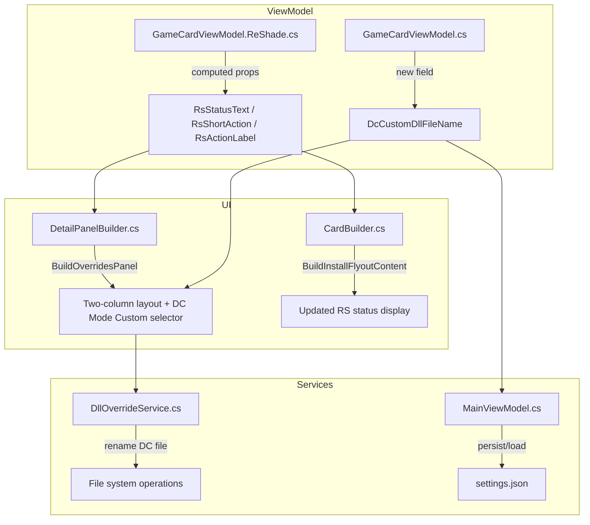

# Design Document: DC Mode UI Enhancements

## Overview

This feature enhances the DC Mode experience in RenoDXCommander across five areas:

1. **DC Installed Indicator** — When DC Mode is active and Display Commander is installed, the ReShade status row shows a green "Installed" label instead of the generic "DC Mode" text.
2. **Emoji Removal** — The greyed-out ReShade install button in DC Mode displays clean text ("DC Mode") without emoji characters.
3. **Two-Column Override Panel** — The DC Mode dropdown and Global Shaders toggle are placed side-by-side in a two-column layout with a vertical divider.
4. **DC Mode Custom Option** — A new "DC Mode Custom" entry in the per-game DC Mode dropdown with an editable DLL filename selector.
5. **Persistence** — DC Mode Custom DLL filename selections are saved/restored across sessions and panel reopens.

The app is a WinUI 3 desktop application (.NET 8) using CommunityToolkit.Mvvm for MVVM, with imperative UI construction in `CardBuilder` and `DetailPanelBuilder`.

## Architecture

The changes span three layers of the existing architecture:



All changes follow the existing patterns: computed properties in partial ViewModel files, imperative UI construction in builder classes, and persistence through the existing settings serialization in `MainViewModel`.

## Components and Interfaces

### 1. GameCardViewModel.ReShade.cs — Status Text Changes

Modify three computed properties to incorporate `IsDcInstalled` state:

- `RsStatusText`: When `RsBlockedByDcMode && IsDcInstalled` → return `"Installed"` (green). When `RsBlockedByDcMode && !IsDcInstalled` → return `"DC Mode"` (muted).
- `RsStatusColor`: When `RsBlockedByDcMode && IsDcInstalled` → return `"#5ECB7D"`. When `RsBlockedByDcMode && !IsDcInstalled` → return `"#6B7A8E"`.
- `RsShortAction`: When `RsBlockedByDcMode` → return `"DC Mode"` (no emoji).
- `RsActionLabel`: When `RsBlockedByDcMode` → return `"DC Mode — ReShade managed globally"` (no emoji).

The `OnRsBlockedByDcModeChanged` and `NotifyDcStatusDependents` methods must also fire `RsStatusText`/`RsStatusColor` notifications so the UI updates when DC install state changes while DC Mode is active.

### 2. GameCardViewModel.cs — New Observable Property

Add a new observable property for the DC Mode Custom DLL filename:

```csharp
[ObservableProperty] private string? _dcCustomDllFileName;
```

This stores the per-game custom DLL filename when "DC Mode Custom" is selected. The `PerGameDcMode` property will use a new value `3` to represent "DC Mode Custom".

### 3. DetailPanelBuilder.BuildOverridesPanel — Two-Column Layout

Replace the current stacked DC Mode combo + shader toggle with a `Grid` containing two equal columns separated by a vertical `Border` divider:

- Left column: DC Mode combo + conditional DC Mode Custom DLL selector
- Right column: Global Shaders toggle + Select Shaders button

### 4. DetailPanelBuilder — DC Mode Custom Selector

When `dcModeCombo.SelectedIndex == 4` (DC Mode Custom):
- Show an editable `ComboBox` populated with `DllOverrideConstants.CommonDllNames`
- Auto-save on `SelectionChanged` and `KeyDown` (Enter)
- Trigger DC file rename via `DllOverrideService` or direct file rename logic

### 5. MainViewModel — Persistence

Extend the existing per-game settings serialization to include `DcCustomDllFileName`. The settings store already handles `PerGameDcModeOverrides` as a dictionary — the custom DLL filename will be stored alongside it (either as a parallel dictionary or by extending the value type).

### 6. DllOverrideService — File Rename on DC Mode Custom

When switching to/from DC Mode Custom, the installed DC file needs to be renamed. This reuses the existing `File.Move` pattern from `EnableDllOverride`/`UpdateDllOverrideNames`.

## Data Models

### Existing Models (Modified)

**GameCardViewModel** — Add:
```csharp
[ObservableProperty] private string? _dcCustomDllFileName;
```

**PerGameDcMode values** — Extended:
| Value | Meaning |
|-------|---------|
| `null` | Follow global DC Mode |
| `0` | Exclude (Off) |
| `1` | DC Mode 1 (dxgi.dll proxy) |
| `2` | DC Mode 2 (winmm.dll proxy) |
| `3` | DC Mode Custom (user-specified DLL) |

### Settings Persistence

A new dictionary in the settings store:
```csharp
Dictionary<string, string> DcCustomDllFileNames
```
Keyed by game name, value is the custom DLL filename. Serialized to `settings.json` alongside existing `PerGameDcModeOverrides`.

### DllOverrideConstants.CommonDllNames (Unchanged)

The existing `CommonDllNames` array is reused to populate the DC Mode Custom dropdown. No changes needed.


## Correctness Properties

*A property is a characteristic or behavior that should hold true across all valid executions of a system — essentially, a formal statement about what the system should do. Properties serve as the bridge between human-readable specifications and machine-verifiable correctness guarantees.*

### Property 1: RS status text reflects DC install state under DC Mode

*For any* `GameCardViewModel` where `RsBlockedByDcMode` is true, if `IsDcInstalled` is true then `RsStatusText` should equal `"Installed"` and `RsStatusColor` should equal `"#5ECB7D"`, otherwise `RsStatusText` should equal `"DC Mode"` and `RsStatusColor` should equal `"#6B7A8E"`.

**Validates: Requirements 1.1, 1.2**

### Property 2: DC Mode RS labels contain no emoji

*For any* `GameCardViewModel` where `RsBlockedByDcMode` is true, `RsShortAction` should equal `"DC Mode"` and `RsActionLabel` should equal `"DC Mode — ReShade managed globally"`, and neither string should contain any emoji characters.

**Validates: Requirements 2.1, 2.2**

### Property 3: Non-DC-Mode RS labels retain emoji prefixes

*For any* `GameCardViewModel` where `RsBlockedByDcMode` is false and `RsIsInstalling` is false, `RsShortAction` should start with one of the known emoji prefixes (`"⬇"`, `"⬆"`, `"↺"`) and `RsActionLabel` should start with one of the known emoji prefixes (`"⬇"`, `"⬆"`, `"↺"`).

**Validates: Requirements 2.3**

### Property 4: DC Mode Custom selector visibility matches selection

*For any* DC Mode combo selection index, the DLL filename selector should be visible if and only if the selected index corresponds to "DC Mode Custom" (index 4). For all other indices (0–3), the selector should be hidden.

**Validates: Requirements 4.2, 4.3**

### Property 5: DC Mode Custom renames DC file to chosen filename

*For any* game with DC installed and a valid custom DLL filename selected, switching to DC Mode Custom should result in the DC file on disk being renamed to the chosen filename.

**Validates: Requirements 4.7**

### Property 6: Switching away from DC Mode Custom restores standard filename

*For any* game currently in DC Mode Custom with a custom-named DC file, switching to DC Mode 1 should result in the DC file being renamed to the DC Mode 1 standard filename, and switching to DC Mode 2 should result in the DC Mode 2 standard filename.

**Validates: Requirements 4.9**

### Property 7: DC Custom DLL filename persistence round-trip

*For any* game name and valid DLL filename string, persisting the DC Mode Custom filename to the settings store and then loading it back should return the same filename.

**Validates: Requirements 4.6, 5.1**

### Property 8: DC Custom settings restoration on panel open

*For any* game with `PerGameDcMode == 3` and a saved `DcCustomDllFileName`, opening the Override Panel should result in the DC Mode combo showing index 4 ("DC Mode Custom") and the DLL filename selector displaying the saved filename.

**Validates: Requirements 5.2**

## Error Handling

| Scenario | Handling |
|----------|----------|
| DC file rename fails (file locked, permissions) | Log via `CrashReporter.Log`, leave file in place, show error in `DcActionMessage`. Follows existing pattern in `DllOverrideService`. |
| Custom DLL filename is empty/whitespace | Fall back to the default DC filename for the active mode (Requirement 4.8). |
| Custom DLL filename conflicts with existing file | Same pattern as existing `EnableDllOverride` — delete target if it exists, then move. |
| Settings file missing or corrupt `DcCustomDllFileNames` | Default to empty dictionary. Existing settings deserialization already handles missing keys gracefully. |
| Game folder no longer exists when rename is attempted | Log warning, skip rename. Existing `DllOverrideService` pattern. |

## Testing Strategy

### Unit Tests

- Verify `RsStatusText` returns `"Installed"` when `RsBlockedByDcMode=true` and `IsDcInstalled=true`.
- Verify `RsStatusText` returns `"DC Mode"` when `RsBlockedByDcMode=true` and `IsDcInstalled=false`.
- Verify `RsShortAction` and `RsActionLabel` contain no emoji when `RsBlockedByDcMode=true`.
- Verify DC Mode combo options array contains exactly 5 items with "DC Mode Custom" at index 4.
- Verify reset clears `DcCustomDllFileName` and sets `PerGameDcMode` to null.
- Verify fallback to default DC filename when custom filename is empty.

### Property-Based Tests

Use a property-based testing library for C# (e.g., **FsCheck** with xUnit or **CsCheck**).

Each property test must:
- Run a minimum of 10 iterations
- Reference the design property with a tag comment: `// Feature: dc-mode-ui-enhancements, Property N: <title>`
- Generate random `GameCardViewModel` states (varying `RsBlockedByDcMode`, `IsDcInstalled`, `RsStatus`, `RsIsInstalling`, `DcStatus`, `PerGameDcMode`, `DcCustomDllFileName`)

Property tests to implement:
1. **Property 1** — RS status text/color mapping under DC mode
2. **Property 2** — DC Mode RS labels contain no emoji
3. **Property 3** — Non-DC-Mode RS labels retain emoji prefixes
4. **Property 4** — DC Mode Custom selector visibility
5. **Property 7** — DC Custom DLL filename persistence round-trip

Properties 5, 6, and 8 involve file system operations or UI construction and are better covered by integration/unit tests with specific examples rather than randomized property tests.
