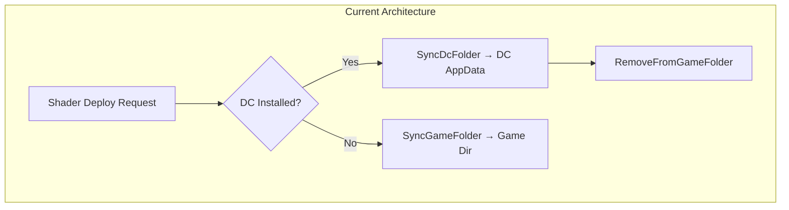
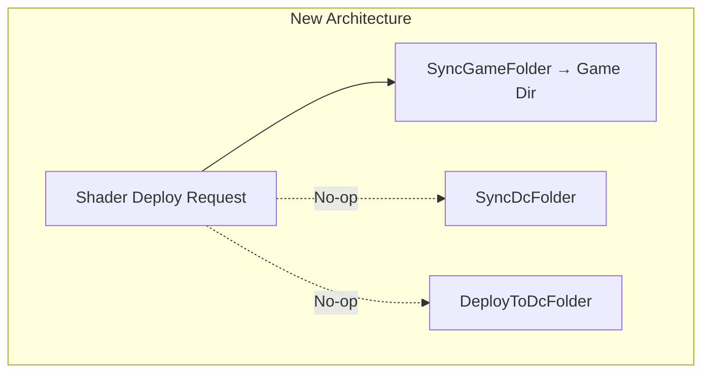

# Design Document: Local Shader Deployment

## Overview

This feature eliminates the dual-path shader deployment model in RDXC. Currently, shaders are routed to either a global Display Commander AppData folder (`%LOCALAPPDATA%\Programs\Display_Commander\Reshade\Shaders\` and `Textures\`) or a per-game local folder (`<GameDir>\reshade-shaders\`), depending on DC mode and DC installation status. The new architecture deploys shaders exclusively to game-local folders, regardless of DC mode. The DC AppData folder retains only ReShade DLL files.

Key changes:
- `DeployToDcFolder()` and `SyncDcFolder()` become no-ops for shader/texture files
- `SyncShadersToAllLocations()` always routes to `SyncGameFolder()` for every game with ReShade installed
- `InstallDcAsync()` preserves local shaders instead of removing them
- `InstallReShadeAsync()` always deploys shaders locally
- `ApplyDcModeSwitch()` no longer triggers shader removal
- A one-time startup migration renames legacy `Shaders`/`Textures` folders in DC AppData to `.old`

## Architecture

The change simplifies the shader deployment flow from a conditional two-target model to a single-target model:





### Component Interaction Flow (Post-Change)

```mermaid
sequenceDiagram
    participant MVM as MainViewModel
    participant AIS as AuxInstallService
    participant SPS as ShaderPackService
    participant FS as File System

    Note over MVM: Startup
    MVM->>SPS: MigrateLegacyDcShaders()
    SPS->>FS: Rename Shaders→Shaders.old, Textures→Textures.old in DC AppData

    Note over MVM: Install DC
    MVM->>AIS: InstallDcAsync()
    AIS->>FS: Copy DC DLL to game folder
    AIS->>SPS: SyncGameFolder(gameDir, mode)
    SPS->>FS: Deploy shaders to gameDir/reshade-shaders/

    Note over MVM: Install ReShade
    MVM->>AIS: InstallReShadeAsync()
    AIS->>FS: Copy ReShade DLL to game folder
    AIS->>SPS: SyncGameFolder(gameDir, mode)

    Note over MVM: DC Mode Switch
    MVM->>MVM: ApplyDcModeSwitch()
    Note over MVM: Rename DLLs only, no shader operations

    Note over MVM: Refresh / Deploy All
    MVM->>SPS: SyncShadersToAllLocations()
    loop Every game with RS installed
        SPS->>SPS: SyncGameFolder(gameDir, mode)
    end
