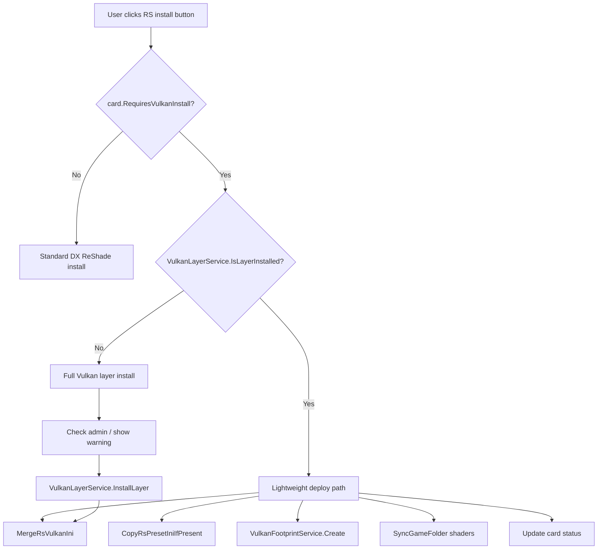

# Design Document: Vulkan ReShade Install Flow

## Overview

This feature introduces a two-tier install path for Vulkan ReShade games. When the global Vulkan implicit layer is already registered (DLL, manifest, and registry entry all present), clicking the ReShade install button performs a lightweight deploy — copying only the Vulkan INI and footprint to the game folder, deploying shaders, and optionally copying the preset. When the layer is absent, the existing full install flow (admin-elevated DLL copy + manifest write + registry registration) runs as before.

The change touches four areas:

1. **ViewModel computed properties** — `RsShortAction` and `RsActionLabel` gain Vulkan-aware label logic that checks `VulkanLayerService.IsLayerInstalled()` and the presence of `reshade.ini` in the game folder.
2. **Install orchestration** — `MainViewModel.InstallReShadeVulkanAsync` is split into a lightweight path (layer present) and the existing full path (layer absent).
3. **Detail panel** — `DetailPanelBuilder.UpdateDetailComponentRows` already has a Vulkan branch; it will consume the new ViewModel labels instead of computing them inline.
4. **Card flyout** — `CardBuilder.BuildInstallFlyoutContent` already reads `RsShortAction`; no structural change needed — the new label flows through automatically.

## Architecture



### Decision: Compute layer status at action time, not as an observable property

`VulkanLayerService.IsLayerInstalled()` reads the registry and checks two files on disk. Making it an `[ObservableProperty]` would require polling or event-based invalidation with no clear trigger. Instead, the computed properties (`RsShortAction`, `RsActionLabel`) call `IsLayerInstalled()` directly each time they are evaluated. This is acceptable because:

- The check is fast (one registry read + two `File.Exists` calls).
- These properties are only evaluated when the UI renders a card or detail panel, not in a tight loop.
- The install handler also calls `IsLayerInstalled()` at action time to decide the path, so the label and action are always consistent.

### Decision: Reuse existing `InstallReShadeVulkanAsync` with an early branch

Rather than creating a separate method for the lightweight deploy, the existing `InstallReShadeVulkanAsync` gains an early `if (VulkanLayerService.IsLayerInstalled())` branch that skips the admin check, warning dialog, and `InstallLayer()` call. This keeps the Vulkan install logic in one place and avoids duplicating the INI merge / footprint / shader deploy steps.

## Components and Interfaces

### GameCardViewModel.ReShade.cs — Modified computed properties

**`RsShortAction`** (card flyout label):
- If `RequiresVulkanInstall` is true:
  - Layer installed + `reshade.ini` exists in game folder → `"↺ Reinstall"`
  - Layer installed + no `reshade.ini` → `"⬇ Vulkan RS"`
  - Layer not installed → `"⬇ Install"`
- Otherwise: existing logic unchanged.

**`RsActionLabel`** (detail panel button label):
- If `RequiresVulkanInstall` is true:
  - Layer installed + `reshade.ini` exists → `"Reinstall Vulkan ReShade"`
  - Layer installed + no `reshade.ini` → `"Install Vulkan ReShade"`
  - Layer not installed → `"Install Vulkan Layer"`
- Otherwise: existing logic unchanged.

Both properties use a helper:
```csharp
private bool IsVulkanRsActive => RequiresVulkanInstall
    && File.Exists(Path.Combine(InstallPath, "reshade.ini"));
```

### MainViewModel.InstallReShadeVulkanAsync — Branched install logic

```
if VulkanLayerService.IsLayerInstalled():
    // Lightweight deploy — no admin, no InstallLayer()
    1. MergeRsVulkanIni(card.InstallPath)
    2. CopyRsPresetIniIfPresent(card.InstallPath)
    3. VulkanFootprintService.Create(card.InstallPath)
    4. SyncGameFolder(card.InstallPath, selection)
    5. ReadInstalledVersion from layer directory
    6. Update card: RsStatus = Installed, version, success message
else:
    // Full install — existing flow (admin check, warning, InstallLayer, then same deploy steps)
```

### DetailPanelBuilder.UpdateDetailComponentRows — Simplified Vulkan branch

The current Vulkan branch in `UpdateDetailComponentRows` computes labels inline (`vulkanLayerInstalled ? "Reinstall Vulkan Layer" : "Install Vulkan Layer"`). After this change, it reads `card.RsActionLabel` directly — same as the non-Vulkan branch — because the ViewModel now encapsulates the label logic. The status text and color logic for the Vulkan case remain in the detail panel builder since they depend on `reshade.ini` existence checked at render time.

### CardBuilder — No changes

`BuildInstallFlyoutContent` already reads `card.RsShortAction` for the button label. The new Vulkan-aware labels flow through automatically.

## Data Models

No new data models are introduced. The existing types are sufficient:

- **`GameCardViewModel`** — gains Vulkan-aware computed property logic in `RsShortAction` and `RsActionLabel`. No new observable fields.
- **`VulkanLayerService`** — static, unchanged. `IsLayerInstalled()` is called at property evaluation and action time.
- **`VulkanFootprintService`** — static, unchanged. `Create()` is called during both lightweight and full deploy.
- **`AuxInstallService`** — static helpers (`MergeRsVulkanIni`, `CopyRsPresetIniIfPresent`, `ReadInstalledVersion`) are reused as-is.
- **`GameStatus`** enum — `Installed` / `NotInstalled` values used unchanged.


## Correctness Properties

*A property is a characteristic or behavior that should hold true across all valid executions of a system — essentially, a formal statement about what the system should do. Properties serve as the bridge between human-readable specifications and machine-verifiable correctness guarantees.*

### Property 1: RsShortAction label correctness for Vulkan games

*For any* `GameCardViewModel` where `RequiresVulkanInstall` is true, given a boolean `layerInstalled` and a boolean `reshadeIniExists` (indicating whether `reshade.ini` exists in the game folder):
- If `layerInstalled` is true and `reshadeIniExists` is true, `RsShortAction` shall return `"↺ Reinstall"`.
- If `layerInstalled` is true and `reshadeIniExists` is false, `RsShortAction` shall return `"⬇ Vulkan RS"`.
- If `layerInstalled` is false, `RsShortAction` shall return `"⬇ Install"`.

**Validates: Requirements 1.1, 1.2, 1.3**

### Property 2: RsActionLabel label correctness for Vulkan games

*For any* `GameCardViewModel` where `RequiresVulkanInstall` is true, given a boolean `layerInstalled` and a boolean `reshadeIniExists`:
- If `layerInstalled` is true and `reshadeIniExists` is false, `RsActionLabel` shall return `"Install Vulkan ReShade"`.
- If `layerInstalled` is true and `reshadeIniExists` is true, `RsActionLabel` shall return `"Reinstall Vulkan ReShade"`.
- If `layerInstalled` is false, `RsActionLabel` shall return `"Install Vulkan Layer"`.

**Validates: Requirements 2.1, 2.2, 2.3**

### Property 3: Lightweight deploy creates all expected files

*For any* game directory and any combination of (Vulkan INI template exists, preset file exists), when the lightweight deploy path executes (layer already installed), the game directory shall contain:
- `reshade.ini` (merged from the Vulkan INI template)
- `RDXC_VULKAN_FOOTPRINT` (the footprint marker)
- `ReShadePreset.ini` if and only if the preset file existed in the inis directory before deploy
- Shaders synced to the game folder via `SyncGameFolder`

**Validates: Requirements 3.1, 3.2, 3.3, 3.4, 4.3**

### Property 4: InstallLayer invoked if and only if layer is absent

*For any* Vulkan game install action, `VulkanLayerService.InstallLayer()` shall be called if and only if `VulkanLayerService.IsLayerInstalled()` returns false at the time of the action. When the layer is already installed, `InstallLayer()` shall not be called.

**Validates: Requirements 3.5, 4.1**

### Property 5: Card status updated after successful deploy

*For any* successful Vulkan ReShade deploy (lightweight or full), the card's `RsStatus` shall be set to `GameStatus.Installed` and `RsActionMessage` shall contain a success indicator (non-empty, starts with "✅").

**Validates: Requirements 5.1, 5.3**

## Error Handling

| Scenario | Handling |
|---|---|
| `MergeRsVulkanIni` throws `FileNotFoundException` (no template) | Catch in `InstallReShadeVulkanAsync`, set `card.RsActionMessage` to error string, leave `RsStatus` unchanged. |
| `VulkanFootprintService.Create` fails (IO error) | The service swallows exceptions internally and logs. Deploy continues — footprint absence is non-fatal (game still works, just won't be detected as Vulkan RS on next scan). |
| `CopyRsPresetIniIfPresent` fails | The service swallows exceptions internally. Non-fatal — preset is optional. |
| `SyncGameFolder` throws | Catch in `InstallReShadeVulkanAsync`, report error on card. |
| Lightweight deploy on read-only game folder | `MergeRsVulkanIni` throws `UnauthorizedAccessException`. Caught by the existing `catch (Exception ex)` block, error shown on card. |
| `IsLayerInstalled()` returns stale result (layer removed between label render and click) | The install handler re-checks `IsLayerInstalled()` at action time. If the layer was removed between render and click, the full install path runs — correct behavior. |

## Testing Strategy

### Unit Tests

- Verify `RsShortAction` returns correct labels for non-Vulkan games (existing behavior preserved).
- Verify `RsActionLabel` returns correct labels for non-Vulkan games (existing behavior preserved).
- Verify `DetailPanelBuilder` reads `card.RsActionLabel` for Vulkan games instead of computing labels inline.
- Verify lightweight deploy error path: simulate IO exception, confirm card status unchanged and error message set.
- Verify admin dialog is shown when layer is absent and process is not admin (example test).
- Verify admin dialog is NOT shown when layer is present (example test).

### Property-Based Tests

Use **FsCheck** (already used in the project's test suite) with minimum 100 iterations per property.

Each property test generates random combinations of:
- `layerInstalled` (bool)
- `reshadeIniExists` (bool) — controlled by creating/not creating `reshade.ini` in a temp game directory
- `presetExists` (bool) — controlled by creating/not creating `ReShadePreset.ini` in the inis directory
- `requiresVulkanInstall` (bool) — set on the card

Property tests must be tagged with comments referencing the design property:
- `// Feature: vulkan-reshade-install-flow, Property 1: RsShortAction label correctness for Vulkan games`
- `// Feature: vulkan-reshade-install-flow, Property 2: RsActionLabel label correctness for Vulkan games`
- `// Feature: vulkan-reshade-install-flow, Property 3: Lightweight deploy creates all expected files`
- `// Feature: vulkan-reshade-install-flow, Property 4: InstallLayer invoked if and only if layer is absent`
- `// Feature: vulkan-reshade-install-flow, Property 5: Card status updated after successful deploy`

Each correctness property is implemented by a single property-based test. Tests should use temp directories for game folders and mock/spy `VulkanLayerService.IsLayerInstalled()` via the testable overload that accepts registry hive and paths.
