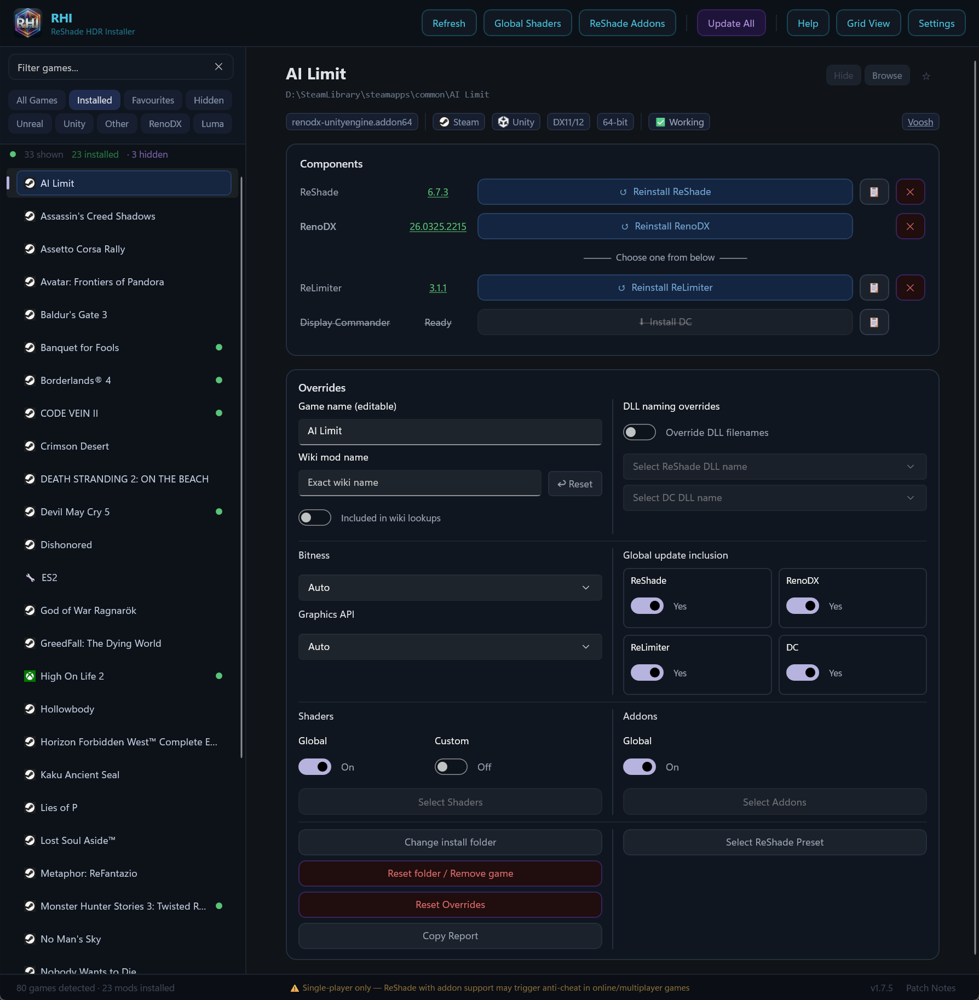

# RHI — ReShade HDR Installer

RHI is a WinUI 3 desktop application for managing HDR mod installations on PC games. It auto-detects game libraries across eight storefronts, installs and updates ReShade, RenoDX, ReLimiter, Display Commander, RE Framework, and Luma Framework components, and keeps everything in sync — all from a single interface.

> **⚠ Single-player only:** RHI installs ReShade with full addon support, which may be flagged by anti-cheat in online/multiplayer games. Uninstall ReShade before playing online.

## Feature Highlights

- **Auto-detection** — scans Steam, GOG, Epic Games, EA App, Ubisoft Connect, Xbox/Game Pass, Battle.net, and Rockstar libraries on every launch
- **One-click install** — install, update, or uninstall ReShade, RenoDX, ReLimiter, Display Commander, RE Framework, and Luma Framework with a single button
- **Frame rate limiter choice** — ReLimiter and Display Commander are mutually exclusive per game; installing one disables the other
- **Drag-and-drop** — drop a game `.exe`, addon file, archive, or URL to add games and install mods instantly
- **Archive auto-install** — archives containing "renodx" in the filename (e.g. from Nexus Mods) are detected in your Downloads folder and installed automatically
- **Per-game overrides** — customise DLL naming, shader selection, and component update preferences per game
- **Update detection** — detect and apply component updates across all games with Update All (covers ReShade, RenoDX, ReLimiter, Display Commander, and RE Framework)
- **Shader pack management** — deploy and sync 40+ shader packs (Essential, Recommended, Extra) across installed games, with automatic dependency resolution
- **ReShade addon management** — browse, download, and toggle curated ReShade addons from the official list. Enabled addons are auto-deployed when ReShade is installed, removed when ReShade is uninstalled, and synced on every Refresh
- **ReShade preset deployment** — place `.ini` preset files in the reshade-presets folder and deploy them to any game from the overrides panel
- **Game report** — Copy Report button in the overrides panel generates a diagnostic code for Discord or GitHub issues, showing detected vs corrected settings
- **Performance** — parallel shader downloads, parallel game folder syncs, and cached graphics API detection for fast startup

## Quick Start

1. **Download and run RHI** — games are auto-detected from Steam, GOG, Epic Games, EA App, Ubisoft Connect, Xbox/Game Pass, Battle.net, and Rockstar.
2. **Select a game** from the sidebar. Use search or filter chips to narrow the list.
3. **Install components** from the detail panel — ReShade, RenoDX, and a frame rate limiter (ReLimiter or Display Commander) each have a one-click install button.
4. **Launch the game**, press **Home** to open the ReShade overlay, go to **Add-ons**, and configure RenoDX.

## Download & System Requirements

Grab the latest installer from the [GitHub Releases page](https://github.com/RankFTW/RenoDXChecker/releases).

**Requires:** Windows 10/11 (x64) and [.NET 8 Desktop Runtime](https://dotnet.microsoft.com/download/dotnet/8.0).

## Troubleshooting

| Problem | Fix |
|---------|-----|
| Game not detected | Click **Add Game** in Settings or drag the game's `.exe` onto the window |
| Xbox games missing | Click **Refresh** — RHI uses the PackageManager API which may need a moment |
| ReShade not loading | Check the install path via 📁 — the ReShade DLL must be next to the game executable |
| Black screen (Unreal) | In ReShade → Add-ons → RenoDX, set `R10G10B10A2_UNORM` to `output size` |
| UE-Extended not working | Enable in-game HDR — UE-Extended requires native HDR output |
| Downloads failing | Click **Refresh**, or clear cache from Settings → Open Downloads Cache |
| Foreign DLL blocking install | Choose **Overwrite** in the confirmation dialog, or cancel to keep the existing file |
| Games/mods out of sync | Settings → **Full Refresh** to clear all caches and re-scan |

## Third-Party Components

| Component | Author | Licence |
|-----------|--------|---------|
| [ReShade](https://reshade.me) | Crosire | [BSD 3-Clause](https://github.com/crosire/reshade/blob/main/LICENSE.md) |
| [RenoDX](https://github.com/clshortfuse/renodx) | clshortfuse & contributors | [MIT](https://github.com/clshortfuse/renodx/blob/main/LICENSE) |
| [ReLimiter](https://github.com/RankFTW/ReLimiter) | RankFTW | Source-available |
| [Display Commander](https://github.com/lobotomyx/display-commander) | lobotomyx | Source-available |
| [RE Framework](https://github.com/praydog/REFramework-nightly) | praydog | [MIT](https://github.com/praydog/REFramework/blob/master/LICENSE) |
| [Luma Framework](https://github.com/Filoppi/Luma-Framework) | Pumbo (Filoppi) | Source-available |
| [7-Zip](https://www.7-zip.org/) | Igor Pavlov | [LGPL-2.1 / BSD-3-Clause](https://www.7-zip.org/license.txt) |

> RHI is an unofficial third-party tool, not affiliated with or endorsed by the RenoDX project, Crosire, or the Luma Framework. All mod files are downloaded from their official sources at runtime and are not redistributed.

## Acknowledgements

RHI would not be possible without the hard work of the entire RenoDX team and [Crosire](https://reshade.me), the creator of ReShade. Their dedication to open-source HDR modding is what makes tools like this one viable. Thank you to every mod author, contributor, and tester who keeps pushing PC HDR forward.

## Links

[RenoDX](https://github.com/clshortfuse/renodx) · [RenoDX Wiki](https://github.com/clshortfuse/renodx/wiki/Mods) · [ReShade](https://reshade.me) · [Luma Framework](https://github.com/Filoppi/Luma-Framework) · [Luma Mods List](https://github.com/Filoppi/Luma-Framework/wiki/Mods-List) · [ReLimiter](https://github.com/RankFTW/ReLimiter) · [HDR Guides](https://www.hdrmods.com)

[RenoDX Discord](https://discord.gg/gF4GRJWZ2A) · [HDR Den Discord](https://discord.gg/k3cDruEQ) · [RHI Support](https://discordapp.com/channels/1296187754979528747/1475173660686815374) · [Ultra+ Discord](https://discord.gg/pQtPYcdE)

[Support RHI on Ko-Fi ☕](https://ko-fi.com/rankftw)

---

For comprehensive documentation, see the [Detailed Guide](docs/DETAILED_GUIDE.md).
